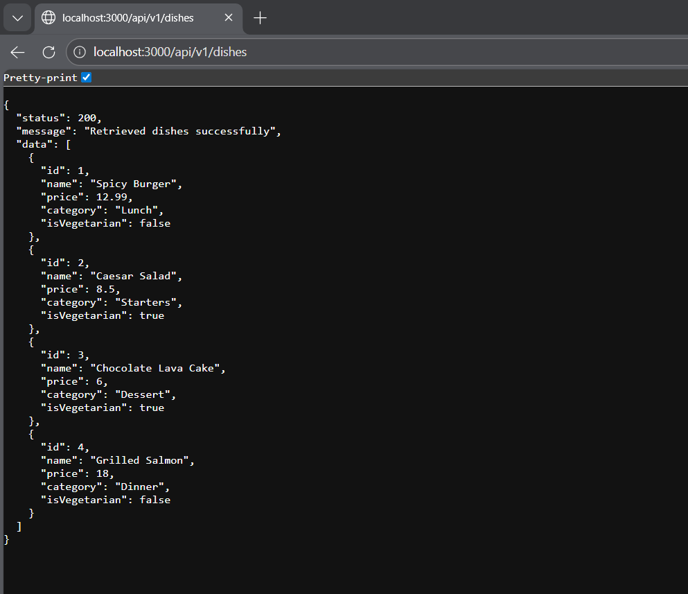
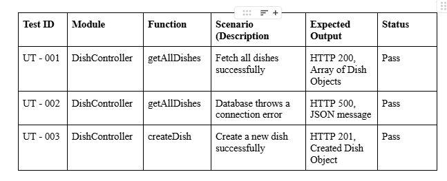

Markdown
2. # RESTful API Activity 
3. ## Best Practices Implementation
4. **1. Environment Variables:**
5. - Why did we put `BASE_URI` in `.env` instead of hardcoding it?
6. - Answer: We put base_url in .env to avoid configuration values in the source code.

7. **2. Resource Modeling:**
8. - Why did we use plural nouns (e.g., `/dishes`) for our routes?
9. - Answer: We use plural nouns for our routes to represent the collections of resources.

11. - When do we use `201 Created` vs `200 OK`?
12. - Answer: 201 Created is use when a new resource is successfully created while 200 OK is use when a request is successful but it does not create new resource.
13. - Why is it important to return `404` instead of just an empty array or a generic error?
14. - Answer: Returning 404 Not Found allows the client to know that the requested resource does not exist.
15.
16. **4. Testing:**
(Paste a screenshot of a successful GET request here) 

------------------------------------------------------------------

# Database Design Decisions

## 1. Why Embed the Review/Tag/Log?

I chose to embed the **Review/Tag/Log** because they are closely related to the parent document and are not intended to exist independently. These data entries are always accessed together with their parent record, so embedding keeps all related information in a single document.

This approach improves performance by allowing the system to retrieve all necessary data in one query without additional lookups. It also simplifies data management, since updates to the parent document can include its associated reviews, tags, or logs in the same operation. Because this data is typically small and context-specific, embedding is an efficient and practical design choice.

## 2. Why Reference the Chef/User/Guest?

I chose to reference the **Chef** because they are independent entities that can be associated with multiple documents within the system. Referencing avoids duplicating the same information across different records, which helps maintain database normalization.

By storing this data separately, updates (such as name or contact details) only need to be made in one place. This ensures data consistency, reduces redundancy, and makes the system more scalable as it grows.

## ACTIVITY 3

## 1. What is the difference between Authentication and Authroization in our  code?
    Answer:Authentication verifies who you are (like logging in), while authorization checks what you can do (like editing a post). Think of it as two steps: "Are you legit?" (authn) and "are you allowed?" (authz).

## 2. Why did we bcryptjs instead of saving passwords as plain text in MongoDB?
    Answer: Saving passwords as plain text is a big no becuase if the DB gets hacked, all passwords are exposed. Bcryptjs hashes & salts passwords, making them unreadable. Even if DB is compromised, passwords are still protected.
    
## 3. What does the protect middleware do when it recieves a JWT from the client?
    Answer: The protect middlesware usually verifies the JWt signature (checks if legit), decodes the token to get user data (like ID), attaches user data to req.user, and calls next() to continue to route handler.

## Activity 5
## Unit Test Documentation

# Essay Questions:
1. Mocking:
## Explain in your own owrds why we mocked Dish.fine and jwt.verify. What specific problem does mocking solve in Unit Testing?
Answer: 
    Para sa akin, ni-mock natin yung Dish.find at jwt.verify kasi sa Unit Testing, ang goal lang    natin ay i-test yung logic ng mismong controller o function na ginagawa natin.
    Kung hindi natin i-mo-mock yung Dish.find, kailangan pa nating kumonekta sa totoong MongoDB. Eh paano kung mabagal yung internet o kaya down yung database? Mag-fe-fail yung test ko kahit wala namang mali sa code ko. Sa jwt.verify naman, ni-mock natin 'to para hindi na natin kailangan ng actual token process. Nagse-set na lang tayo ng 'fake response' para direkta nating ma-test kung ano ang gagawin ng logic natin kapag 'valid' o 'invalid' yung token.
    Ang main problem na nino-solve ng mocking ay yung dependency ng code natin sa mga external factors na hindi naman natin kontrolado, gaya ng database o third-party APIs. Sa pamamagitan ng mocking, na-i-isolate natin yung mismong logic ng controller para maging mas stable ang testing; sigurado tayo na kapag nag-fail ang test, sa code natin ang error at hindi dahil lang down ang external service. Bukod sa ginagawa nitong sobrang bilis ang pag-run ng tests dahil hindi na kailangang mag-antay ng response mula sa network, nagiging mas predictable at reliable din ang buong testing environment natin

2. Code Coverage:
## Look at your Jest Coverage report. Explain what % Brach coverage means. If your Branch coverage is at 50%, what does that tell you about your tests? 
Answer: 
    Ang % Branch Coverage ay tumutukoy sa percentage ng mga 'decision points' o sanga ng logic sa code na nadaanan ng iyong tests. Isipin na yung mga if-else statements o switch cases—bawat condition ay isang 'branch.
    Kung ang Branch Coverage ay nasa 50%, ibig sabihin nito ay kalahati lang ng mga posibleng scenario sa logic ang na-test. Halimbawa, sa isang if-else statement, maaaring na-test lang yung 'Success' path (yung if), pero hindi pa na-test yung 'Failure' o 'Error' path (yung else). Sinasabi nito sa atin na may mga part pa ng code na pwedeng magka-bug pero hindi pa natin nasisiguro kasi hindi pa sila 'covered' o natsitsek ng mga unit tests natin."

3. Testing Middleware:
## In our authMiddleware.test.js, why did we use jest.fn() for the next variable, and why did we assert expect(next).not.toHaveBeenCalled() in the failure scenario?
Answer: 
    Sa authMiddleware.test.js, ginamit natin ang jest.fn() para sa next variable dahil kailangan natin ng isang 'mock function' o fake function na kayang mag-track kung tinawag ba ito o hindi. Sa Express middleware, ang next() ang hudyat na tapos na ang logic at pwede nang tumuloy sa susunod na function. Dahil wala naman tayong totoong middleware chain sa unit test, jest.fn() ang nagsisilbing 'spy' natin para mabantayan ang galaw ng code.
    
    Sa failure scenario, ginamit natin ang expect(next).not.toHaveBeenCalled() dahil iyon ang tamang behavior ng isang secure na middleware. Kapag nag-fail ang authentication (halimbawa, mali ang token o walang authorization header), dapat i-stop ng middleware ang request at mag-return lang ng error response. Kung sakaling matawag ang next() kahit fail ang auth, ibig sabihin may security hole ang code natin dahil pinatitira pa rin nito ang request kahit hindi authorized yung user. Kaya tinitiyak natin sa test na 'not called' dapat ang next para masabing safe ang ating middleware

## ACTIVITY 6: README.md and Questions
1. Unit vs. Integration
Ang pagkakaiba ng Unit Test na ginawa sa Activity 5 sa Integration Test ngayon is yung scope ng sinusuring code; kung saan ang Unit Test ay nakatuon lamang sa pag-isolate at pag-verify ng logic ng isang partikular na function o controller gamit ang mga mocks, ang Integration Test naman ay sinusuri ang ugnayan ng iba't ibang component ng system tulad ng routes, auth middlewares, controllers, at ang mismong database. Sinisiguro ng Integration Test na ang daloy ng request ay hindi nahaharangan ng mga security layers gaya ng JWT verification at matagumpay na nakaka-interact sa database models upang makapag-save o makapag-retrieve ng totoong data, mga bagay na hindi nakikita sa simpleng Unit Testing dahil naka-isolate ang mga dependencies nito.

2. In-Memory Databases
Piniling gamitin ang mongodb-memory-server sa halip na direktang kumonekta sa ating tunay na MongoDB Atlas URI upang matiyak ang bilis at kalinisan ng ating testing environment; dahil tumatakbo ang in-memory database sa RAM, mas mabilis ang execution ng bawat test suite kumpara sa cloud-based connection na dumedepende sa internet speed at latency. Bukod dito, naiiwasan din natin ang "data pollution" o ang pagkapuno ng ating production database ng mga "trash data" mula sa paulit-ulit na testing, habang sinisiguro na ang bawat test run ay laging nagsisimula sa isang clean slate na walang conflict sa mga existing records sa ating totoong database.

3. Supertest
Ang supertest ang nagsisilbing library na nag-si-simulate ng mga HTTP requests gaya ng POST at GET sa ating Express application nang hindi na kinakailangang patakbuhin ang server nang manual sa terminal. Mas mainam itong gamitin kaysa sa Postman para sa ganitong aktibidad dahil ang Supertest ay nagbibigay-daan para sa automated at programmatic testing na direktang kasama sa ating code development cycle, na nagreresulta sa mas mabilis at mas reliable na verification ng API endpoints kumpara sa manual at paisa-isang pag-input ng data sa Postman.